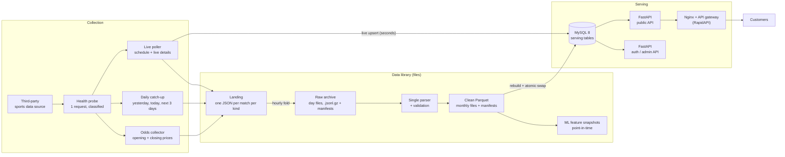
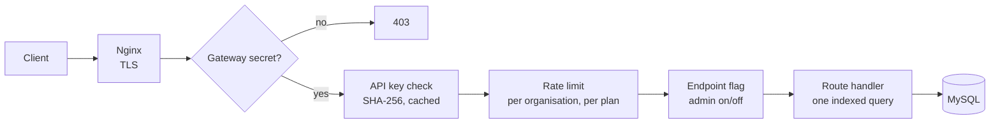
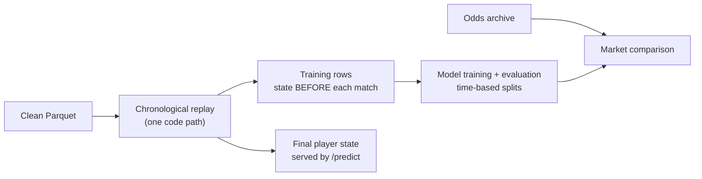

# Architecture

RacketEdge is a tennis data and prediction API: live scores, player profiles, head-to-head, point-by-point logs, Elo ratings and match win probabilities, across every professional tier (ATP, WTA, Challenger, ITF, UTR). This document describes how data flows from collection to the customer, and why it is built that way.

## Overview

Three paths share the same code:

| Path | Latency | What it does |
|---|---|---|
| **Live** | seconds | The poller fetches today's schedule and live match details, lands the raw payloads, and upserts the changed matches straight into the serving tables. |
| **Hourly refresh** | ~1 hour | Folds landing files into the raw archive, rebuilds the clean Parquet months that changed, and rebuilds the serving database, then swaps it in atomically. Aggregates (Elo, career records, form, leaderboards) are recomputed here. |
| **Full rebuild** | ~2 minutes | The whole serving database from the clean Parquet layer: the same code as the hourly refresh, over every month. |

## Design decisions

### Raw first, never edited
Every response from the source is written unchanged before anything parses it, then folded into one compressed file per UTC day per kind (`events`, `statistics`, `pbp`, `odds`), with a manifest holding row counts and SHA-256 checksums. Consequences:
- Nothing downstream needs the network again: a parser fix is applied by re-running the parser over the archive.
- Historical data can always be rebuilt and audited, even if the source changes or disappears.

### One parser, with validation
All JSON-to-row logic lives in one versioned parser per source. Earlier versions parsed the same JSON in several places, and every statistics bug traced back to that duplication. The parser **flags** problems instead of dropping data:
- score consistency (sets vs games, tiebreaks, match tiebreaks)
- statistics sanity (aces ≤ service points, games won vs the official score)
- point-by-point replay (every game has a winner, game counts match the score)
- identity errors (the same player on both sides)

Each match carries `stats_status` (ok / suspect / none) and `pbp_status` (complete / partial / none), so customers and models choose what they trust.

### Clean Parquet as the master copy
Clean data is stored as monthly Parquet files, and two consumers read it:
- **MySQL serving tables**, shaped for the API: one indexed query per endpoint, no JSON parsing per request.
- **DuckDB analytics and ML**, for bulk scans, point-in-time features and training snapshots.

Both load from the same validated rows, so the API and the models cannot disagree about the data.

### Atomic table swap
A rebuild loads new tables next to the live ones and switches them with a single `RENAME TABLE`. The API never sees a half-loaded state, and a failed rebuild leaves the previous data serving.

### Own public IDs
Players, matches and tournaments get RacketEdge IDs through append-only ID maps (source ID → public ID). Customers never see source IDs, existing IDs never change, and a second data source can be added without breaking anyone.

### Collection that fails loudly
- A one-request **health probe** runs before every batch and after any failure. It classifies the problem (access blocked, endpoint changed, payload changed, network, …) with a fix hint, so an outage is diagnosed in seconds rather than by reading stack traces.
- A failing category fails the whole day: a partial schedule is never stored as if complete.
- Scraping is **opt-in**: an admin setting must be on before any paid collection traffic is used.

## Serving layer

- **FastAPI** with Pydantic response models; every error uses one shape: `{"error": "<code>", "detail": …}`.
- **API keys** are stored as SHA-256 hashes; **rate limits** use a sliding window per organisation, by plan.
- **Endpoint flags** let an admin disable an endpoint at runtime without a deploy (503 with a reason).
- **Gateway secret:** in production every `/v1` request must carry the API marketplace's proxy secret, so traffic cannot bypass billing.
- Two services: the public data API, and a private API for accounts, keys and admin.

## Data model (serving)

| Table | Contents |
|---|---|
| `matches`, `doubles_matches` | One row per match: tournament, tier, surface, players, phase, outcome, set scores, quality flags |
| `player_match_stats` | One row per player per singles match. Point and game counts come from the point-by-point log when it is complete, otherwise from vendor statistics marked ok |
| `pbp_points` | One row per point (ATP/WTA): server, score before and after, break / game / deciding point, game-winning point |
| `player_summary`, `player_form`, `elo_leaderboard` | Precomputed aggregates per player and surface scope |
| `id_players`, `id_matches`, `id_tournaments` | Append-only public ID maps |

## Machine-learning path

One replay over every match produces both the training rows and the player state that the prediction endpoint serves, so training and serving use identical feature code. A test proves that a match's own result can never change its features (no leakage). Details: [machine_learning.md](machine_learning.md).

## Delivery

- **Tests:** unit tests, plus BDD acceptance tests (Gherkin, pytest-bdd) that run the real API against a throwaway MySQL in Docker.
- **GitLab CI:** lint (ruff) → test (pytest with a `mysql:8.0` service, JUnit report) → build (Docker image, pushed to the registry from the default branch).
- **Container:** the public API runs under gunicorn with uvicorn workers, as a non-root user, with a health check. Configuration comes only from environment variables, and the model file is mounted at runtime.

Details: [testing_and_ci.md](testing_and_ci.md).

## Scale today

- 712,000 matches (568,000 singles, 143,000 doubles), January 2020 → October 2026; 29,800 players; 8.6 million point-by-point rows
- Pre-match odds requested for 499,000 singles matches (266,000 usable)
- Raw archive about 870 MB compressed; clean Parquet about 200 MB; full serving rebuild in under 2 minutes

## What changes on AWS

The library and services are designed to move without a rewrite:

| Today (local) | AWS |
|---|---|
| Library on disk (raw, clean, ML) | S3 (same layout; Parquet read in place by DuckDB) |
| MySQL in Docker | RDS for MySQL |
| systemd timers (poller, hourly refresh, daily catch-up) | EventBridge schedules + ECS tasks or Lambda for the short jobs |
| FastAPI container | ECS / Fargate behind an API gateway |
| Logs + health probe | CloudWatch metrics and alarms on probe failures and 5xx rates |
