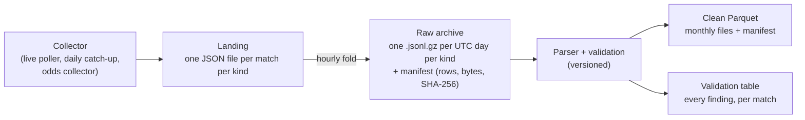

# Data sourcing

How match data gets from a third-party source into a validated, queryable form, and how the collection stays reliable.

## What is collected

| Kind | Content | Coverage |
|---|---|---|
| Schedule and results | Every match: players, tournament, tier, surface, round, status, set and tiebreak scores | All tiers |
| Match statistics | Aces, double faults, first-serve %, service and return points, break points, games | ATP, WTA, Challenger, WTA 125 |
| Point-by-point | Every point in order, with server and score | Every tier where the source logs it: nearly all ATP / WTA / Challenger / UTR matches, about two thirds of ITF matches |
| Pre-match odds | Opening and closing prices per player | All tiers where published |

Details are fetched only for matches that have started, and a finished match gets one final fetch so its numbers are complete.

## Pipeline

### 1. Raw first
Every response is written to disk exactly as received, before any parsing. The hourly fold merges landing files into the day archive (the latest payload for a match wins) and updates a manifest with row counts and checksums. The archive is the source of truth: everything downstream can be rebuilt from it without touching the network.

Current size: about 870 MB compressed for raw JSON (including odds), 200 MB for clean Parquet.

### 2. One parser
A single, versioned parser turns raw JSON into clean rows. It replaced several places that used to parse the same payloads independently. That duplication was the root cause of every statistics bug found during the rebuild:
- last-set statistics taken as match statistics;
- walkovers counted as played matches;
- winners derived wrongly.

### 3. Validation flags, never silent drops
Each finding is recorded with a severity and a source, and the match is kept:

| Area | Examples of checks |
|---|---|
| Score | Sets consistent with games; tiebreak scores valid; match tiebreaks (to 10) recognised; Grand Slam long final sets not mistaken for tiebreaks |
| Statistics | Aces ≤ service points; break points saved ≤ faced; games won consistent with the official score |
| Point-by-point | Replays the whole match: every game has a winner, tiebreak serve rotation is correct, and the rebuilt set scores match the official ones |
| Identity | The same player on both sides (source ID errors, mostly in ITF doubles) |

Each match then carries:
- **`stats_status`**: `ok`, `suspect` (kept but flagged) or `none`;
- **`pbp_status`**: `complete`, `partial` or `none`.

Where both the point-by-point log and vendor statistics exist, point and game counts come from the log when it is complete, so customers get one consistent number.

Parser releases are versioned, and every clean file records the parser version that produced it. A parser change means re-running the parser over the archive: about 13 minutes for six years of data.

### 4. Clean Parquet → serving database and ML
Monthly Parquet files are the master copy of clean data. The serving database and the ML feature pipeline both read them, so the API and the models always agree on the data. See [architecture.md](architecture.md).

## Keeping collection reliable

### Health probe
A single, small request runs before every batch and after any failure. It sorts the result into a class (access blocked, forbidden, endpoint changed, payload changed, network, other) and prints a fix hint. Batches stop immediately when the probe fails, so no paid traffic is spent on requests that would fail day after day.

### Diagnosing an outage: an example
One day every request started failing with a "challenge" response, and the source's website showed a captcha. The obvious fix was a paid captcha-solving service. Before buying one, the problem was narrowed down by changing one variable at a time against a client that worked:
1. a real browser on the same connection: not challenged;
2. that browser's requests replayed outside the browser: worked;
3. each request property removed or changed in turn: the block depended on a single client setting, not on cookies, network address or captcha state.

The fix was a configuration change, not a paid service. The same investigation found that one endpoint had been retired; its replacement was verified against the archive (512 of 512 matches for a test day) before going live. The probe classes above came out of this incident.

**Lesson:** measure before building, and change one thing at a time.

### Cost control
- Collection is **opt-in**: an admin setting must be enabled before anything spends paid collection traffic.
- Connections are reused, so per-connection handshake overhead (larger than many responses) is paid once per session, not per request.
- Every collector is **resumable** and skips what is already stored. Bulk jobs process items in a fixed random order, so the first N are a fair sample for checking cost and coverage before committing to a full run.
- A full backfill of five months (69,642 matches, 148 days) and 499,000 odds requests together used well under 0.5 GB of paid traffic.

## Coverage gaps: ours or the source's?

Auditing coverage by month showed that ITF point-by-point was missing for every match from January 2025 to February 2026, and that 2025 listed about half as many ITF matches as 2024. Before treating it as lost data, the gap was tested: the full schedule for those months was fetched again and point-by-point was requested for a sample of matches. The re-fetch added about 1% more matches and every point-by-point request returned "not found", so the gap is at the source, not in collection. The re-scrape was stopped once that was clear, and the gap is documented wherever it matters (for example, the in-play test window in [machine_learning.md](machine_learning.md) accounts for it).

## Source independence

Public IDs for players, matches and tournaments are RacketEdge's own, mapped from source IDs through append-only tables. A second source, for example a licensed feed, is added as a new parser into the same clean layer, with cross-source match linking by date and players. Nothing downstream changes, and existing IDs stay valid.
