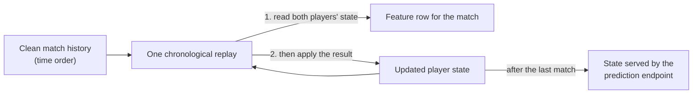

# Machine learning

How RacketEdge rates players and predicts matches, how the models were evaluated, and what the evidence says about where prediction can and cannot improve. All results are on matches the models never saw during training or tuning.

## 1. Starting point: a model that looked too good

The first prediction model reported **79% accuracy** (AUC 0.88). A review of the training code found two problems:
1. **Feature leakage.** Career statistics were each player's *current* totals, not the totals before each match, so a match's features included its own result.
2. **Calibration on the evaluation set.** The probability calibrator was fitted on the same rows the metrics were computed on.

Realistic pre-match tennis models land around 65–70%. The rebuild started from the rule that every number must come from data the model could have had at the time.

## 2. Point-in-time features

- One replay over all 536,000 played singles matches builds each match's features from the players' state **before** the match, then applies the result.
- The state left at the end is exactly what the prediction endpoint serves, so training and serving use the same code (no training/serving skew).
- **A unit test changes a match's result and checks that the match's own features do not change.** Leakage is now a test failure, not a code-review hope.
- Orientation (which player is "A") is randomised deterministically per match, so there is no home/away bias.
- Each snapshot records its provenance: parser version, checksums of the clean files, git commit and rating parameters.

## 3. Elo ratings

Elo is the backbone: an interpretable strength rating per player, overall and per surface, served on player profiles and a leaderboard.

**What was wrong with the first version:**
- a fixed update size for everyone, too slow for newcomers and too jumpy for veterans;
- lower-tier wins inflating ratings;
- surface ratings far below overall ratings because players have few matches per surface. One top player was rated 2470 overall but 1714 on grass.

**Approach:** a tunable rating engine (update size that shrinks with experience, tier weighting, reduced weight for retirements, starting ratings by entry tier, surface/overall blending, optional cross-surface transfer). About 200 candidates were scored on **one season only**, with selection weighted towards the main tour and Challengers. The winner was then checked once on the following season and a half, which tuning never touched. Along a flat optimum, the most moderate setting within noise was chosen, decided before looking at the test results.

**Results (2025–26, unseen):**

| Tier | Accuracy before → after | Log-loss before → after |
|---|---|---|
| Main tour | 61.0% → **66.1%** | 0.651 → **0.608** |
| Challenger / WTA 125 | 62.7% → 67.0% | 0.637 → 0.599 |
| ITF / UTR | 67.2% → 70.3% | 0.608 → 0.565 |

**Findings:**
- Experience-dependent updates were the largest gain.
- Surface-only ratings stay too noisy to predict well; a light blend towards the surface rating helps on every tier once the update size is right.
- Letting a clay match also move grass ratings helped with the old settings, but added nothing after tuning.

## 4. Why the model is hard to improve

A diagnosis before adding complexity:
- **Elo is already calibrated.** Its realised accuracy equals the accuracy it predicts for itself (66.1% vs 65.7% on the main tour), and every probability band matches reality: favourites given 60–65% win 62.7%.
- **The matches are close.** 38% of main-tour matches have a favourite of 60% or less.
- **No segment is broken.** Men, women, surfaces, qualifying and main draw all sit at 65–67%, and cold-start players are under 1% of recent main-tour matches.
- **More of the same information adds little.** A gradient-boosted model with serve and return form, fatigue and head-to-head moves main-tour accuracy by 0.3–0.5 points, which is inside the noise of the test (±0.45). About 70% of its signal comes from the Elo inputs.

So on the main tour, past results are close to exhausted as a pre-match signal. Gains need **different information**, not more of the same.

## 5. New kinds of information

Six groups of features were built from data already held, each strictly before the match, and each tested on its own. Train 2021–24, test 2025–26, LightGBM, log-loss gain with 95% paired-bootstrap intervals:

| Group | Main tour | Challenger | ITF |
|---|---|---|---|
| Fatigue (games and sets in recent days, matches at this event) | – | significant | significant |
| Injury tracks (retirements, walkovers, layoffs) | almost | significant | significant |
| Rating reliability and momentum | significant (ATP) | – | – |
| Surface switch | – | significant | – |
| Home advantage | – | – | – |
| Court speed (tournament ace and hold rates vs norm) | – | – | – |
| **All together** | **significant (ATP)** | **significant** | **significant** |

All together, ATP main-draw accuracy moved from 65.7% (Elo alone) to 66.7%.

Two effects are clear in the raw data:
- players returning from a 6+ week layoff win **38.8%** against an Elo expectation of 47.1%;
- home players beat their expectation by just 0.9 points.

## 6. Against the betting market

Pre-match prices (opening and closing) from a retail bookmaker were collected for all singles matches from 2021 on. The margin was removed before comparison (5–7% depending on tier). Closing prices beat opening prices, as they should (log-loss 0.598 vs 0.605 on a first sample), which confirmed the data behaves like a real market.

**Head to head, 2025–26 (log-loss / accuracy):**

| | ATP main draw | WTA main draw | Challenger | ITF |
|---|---|---|---|---|
| Market, closing | **0.597 / 67.7%** | **0.591 / 67.8%** | **0.590 / 67.9%** | **0.529 / 73.5%** |
| Our model | 0.613 / 66.6% | 0.607 / 66.7% | 0.598 / 67.4% | 0.545 / 72.0% |

**Does the model know anything the market does not?** A blend of market and model was fitted on an earlier season and tested on 2025–26. On ATP and WTA main draws the blend is *worse* than the market alone. In qualifying, Challenger and above all ITF, it is significantly *better*: the model carries information the closing price lacks.

**A mistake caught along the way.** The first betting simulation scored bets at *opening* odds using a blend built from the *closing* price, which amounts to knowing in advance where the price will move. It produced returns of +5% to +24% on every tier. The look-ahead was spotted, the numbers were discarded, and the simulation was rebuilt so that each bet only uses the price known when it is placed.

## 7. A pre-registered forward test

After the fix, one result stood out. In ITF, betting with the market + model blend when its expected value exceeded a threshold returned **+2.6% and +5.7%** at two thresholds, with confidence intervals above zero.

That was found after trying about 30 combinations of tier, threshold and timing on one period, a classic setting for false discoveries. So, **before any new data existed**, the claim and its pass/fail rule were written down and committed:
- the procedure was frozen (models, blend, rating parameters: nothing re-tuned);
- the test set was five months of matches collected afterwards (12 May → 6 October 2026);
- the edge counts as confirmed only if both thresholds show a positive return whose 95% interval lies above zero.

**Result:**

| ITF, blend at closing odds | Discovery period | Forward test (unseen) |
|---|---|---|
| Higher threshold | +5.7% [+1.0, +10.6] | **−2.2% [−9.2, +5.5]** |
| Lower threshold | +2.6% [+0.3, +5.3] | **−2.6% [−6.6, +1.1]** |

**The claim was rejected.** What survived: the blend still beats the ITF market on unseen data (log-loss gain +0.0019, significant), but by about a third of the earlier gain, and far too little to overcome a 7% margin.

## 8. Conclusions

- With results-based data, **the market is ahead of the model on every tier**. The model's useful extra information grows down the tiers, towards automated prices in thin markets, but it is small.
- The process mattered more than any single number:
  - leakage turned into a test;
  - tuning separated from evaluation;
  - significance intervals on every comparison;
  - a look-ahead bug caught;
  - a promising result written down with its pass/fail rule before it was tested.
- **Next directions:**
  - information that results do not contain (player profiles such as handedness, height and age; in-play point-by-point data, where information grows with every point);
  - lower-margin prices for comparison;
  - retraining with more recent seasons, tested again only on future matches.
