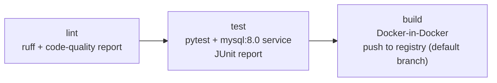

# Testing and CI

How RacketEdge specifies behaviour before writing code, tests it against a real database, and runs it through GitLab CI.

## Specification first (ATDD / BDD)

**BDD** describes behaviour as concrete examples in plain language (Gherkin: *Given* a context, *When* an action, *Then* an observable outcome). **ATDD** is the order of work: write those acceptance criteria as executable tests **before** the implementation, watch them fail, then implement until they pass.

The prediction endpoint's specification is grouped by business rule:

```gherkin
Feature: Match win prediction
  As an API customer (a bettor or an analyst)
  I want win probabilities for a singles match-up, optionally on a given surface
  So that I can compare them with my own estimates or market prices

  Background:
    Given the following players exist:
      | id | name             | overall | hard | clay | grass | indoor |
      | 1  | Clay Specialist  | 1900    | 1850 | 2150 | 1600  | 1800   |
      | 2  | Grass Specialist | 1900    | 1850 | 1600 | 2150  | 1800   |
      | 3  | Journeyman       | 1500    | 1500 | 1500 | 1500  | 1500   |
    And I have a valid API key

  Rule: Predictions are surface-specific

    Scenario Outline: The favourite depends on the surface
      When I request a prediction for player 1 against player 2 on <surface>
      Then the response status is 200
      And "<favourite>" is the favourite
      And the response reports the surface as "<surface>"

      Examples:
        | surface | favourite        |
        | clay    | Clay Specialist  |
        | grass   | Grass Specialist |

  Rule: Invalid requests are rejected with a clear error

    Scenario Outline: An unknown surface is rejected
      When I request a prediction for player 1 against player 2 on <surface>
      Then the response status is 422
      And the error is "validation_error" on field "surface"

      Examples:
        | surface |
        | carpet  |
        | sand    |
        | ice     |
```

The full feature has four rules and 19 scenarios:
- **probabilities are well-formed:** each between 0 and 1, summing to 1, and independent of player order;
- **predictions are surface-specific;**
- **invalid requests are rejected:** unknown surface, unknown player, the same player twice, malformed bodies;
- **a valid API key is required.**

It uses a Background, data tables, Scenario Outlines with Examples, and doc strings.

### Red, then green (visible in the git history)

| Commit | State |
|---|---|
| Acceptance spec, **red** | 19 scenarios written first. 14 passed (behaviour the API already had); **5 failed**: the API silently accepted `carpet`, `sand` and `ice` (falling back to overall ratings), did not recognise `Clay` with a capital letter, and predicted a player against themselves. |
| Implementation, **green** | The smallest change that meets the spec: surface became a closed, case-insensitive set, and a validator rejects identical players. All tests pass. |

The specification exposed real gaps nobody had noticed, and the code changed to meet it, not the other way round.

### How the steps run
- Step definitions (pytest-bdd) map Gherkin lines to Python with typed parameters, and every scenario becomes a named pytest test.
- The API runs **in-process** with FastAPI's test client: real routing, validation, API-key auth, rate limiting, database queries and error handlers, with no mocks between the test and the code.

## A throwaway test database

- **Separate from real data by construction:** its own container and port, no volume (data lives in memory and disappears when the container stops), and the test setup **refuses to run** unless the database name ends in `_test`, because it drops and recreates it.
- **Same schema as production:** rebuilt from the production DDL at the start of every run, so a schema change that breaks the API breaks the tests.
- **Per-scenario data:** player tables are emptied before each scenario; the Background inserts players whose records are identical except their surface ratings, so the surface is the only thing that can change the favourite. Each scenario gets a fresh API key on an unlimited test plan.
- **A stand-in model:** the production model is not in the repository, so a small model with the same inputs is trained at start-up. The acceptance tests check the API's *contract* (validation, probability rules, surface handling), not model accuracy, which is evaluated separately (see [machine_learning.md](machine_learning.md)).

## Unit tests

57 unit tests cover, among other things:
- **the parser**, against real archived matches, checked against tennis invariants rather than earlier output: tiebreak serve rotation, one game-winning point per game, set scores rebuilt from points;
- **the data pipeline**: landing → archive fold, manifests, the coverage policy, schedule assembly, retries;
- **the collection health probe**: every failure class;
- **ratings and features**, including the **leakage test**: changing a match's result must not change that match's own features.

## GitLab CI



| Job | Image / services | What it does | Output |
|---|---|---|---|
| `lint` | `python:3.12-slim` | `ruff check` on the maintained code | Code-quality report in merge requests |
| `test` | `python:3.12-slim` + **`mysql:8.0` service** | Unit + acceptance tests against the service database | **JUnit XML** in GitLab's Tests tab |
| `build` | `docker` + `docker:dind` | Builds the API image; pushes to the project's container registry from the default branch only | Image tagged with the commit |

Details:
- `workflow:rules` prevent duplicate branch and merge-request pipelines.
- pip downloads are cached per requirements-file hash.
- Jobs are interruptible, so a newer push cancels an outdated pipeline.
- Stages run in order, so a lint failure stops the pipeline before the slow jobs.

The first green run on gitlab.com took lint 17 s, test 94 s (all tests passing, listed by scenario name in the Tests tab) and build 97 s.

A small script reproduces the runner locally: it exports the committed tree (like a fresh clone), runs each job's commands in the job's image, and starts a fresh MySQL container as the test service.

**The Docker image:**
- the production gunicorn + uvicorn command;
- a non-root user and a health check;
- configuration only from environment variables, with the model file mounted at runtime;
- an **allowlist** `.dockerignore`, so data, env files and secrets can never enter the image.

## A real bug the pipeline caught

The first run on a clean CI image failed every acceptance test:

> `'cryptography' package is required for sha256_password or caching_sha2_password auth methods`

MySQL 8 authenticates with `caching_sha2_password`. The Python driver needs the `cryptography` package for the first login after a server start; after that, the server caches the login and later connections succeed without it. The package happened to be installed on the development machine and was missing from the requirements. In production, **the API would have lost its database connection after a MySQL restart**. One line in the requirements fixed it.

That is the argument for CI on clean environments, in one example.

## Next

- Response-code consistency across all endpoints, specification first. For example, a missing API key currently returns 422 (framework validation) instead of 401, and some error codes carry whole sentences instead of stable codes. Each fix will be a red → green pair in the history.
- Acceptance specifications for the remaining endpoints (player profile, head-to-head, date routes).
